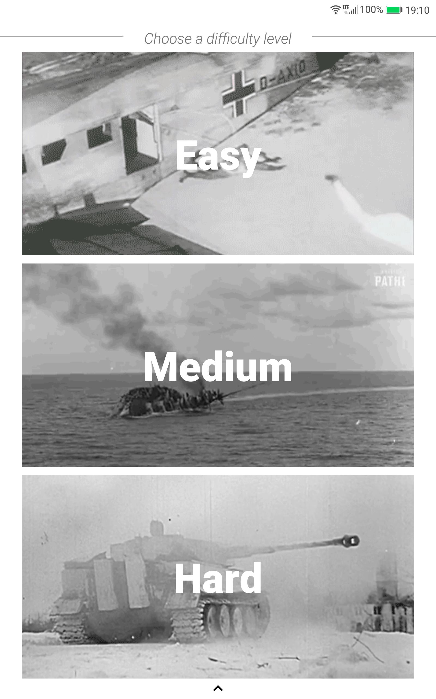
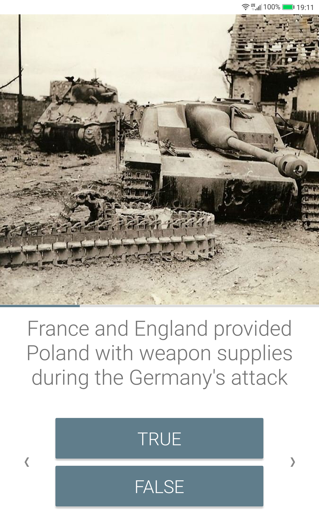
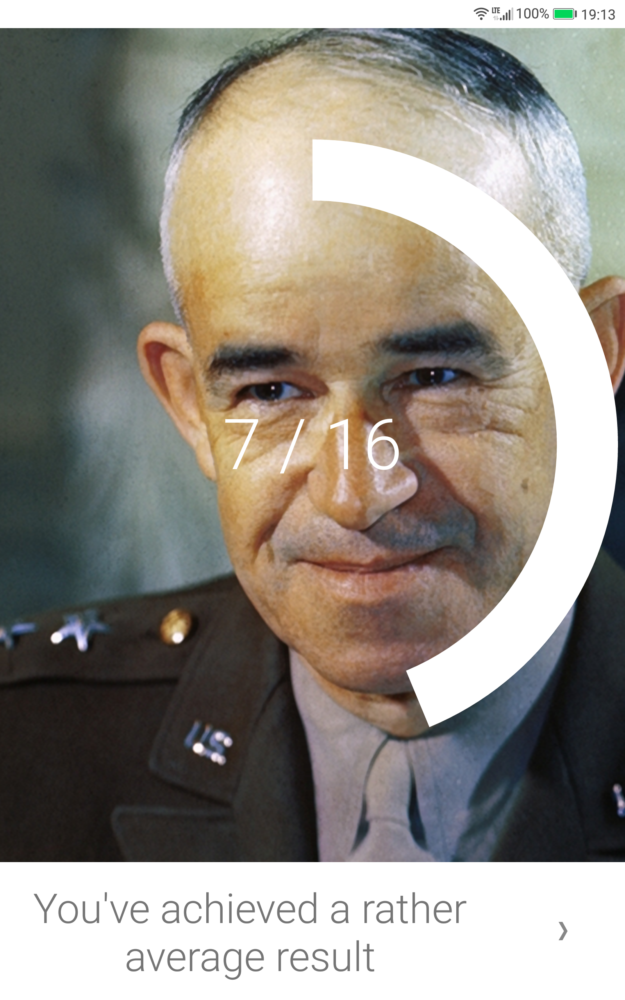

# WW2 Quiz

## About
This is the source code repository for the WW2 Quiz app, available on Google Play store.
 
This app allows for checking one's knowledge on World War 2.

## Current status
The app's source code is almost fully rewritten to AndroidX. 
One feature is not available yet: the slider from the bottom of the main screen that has a toggle to enable detailed answers.

On Google Play Store a fully featured version with an old code base can be found.

## Download
[Google Play Store](https://play.google.com/store/apps/details?id=com.pakita.ww2quiz)

